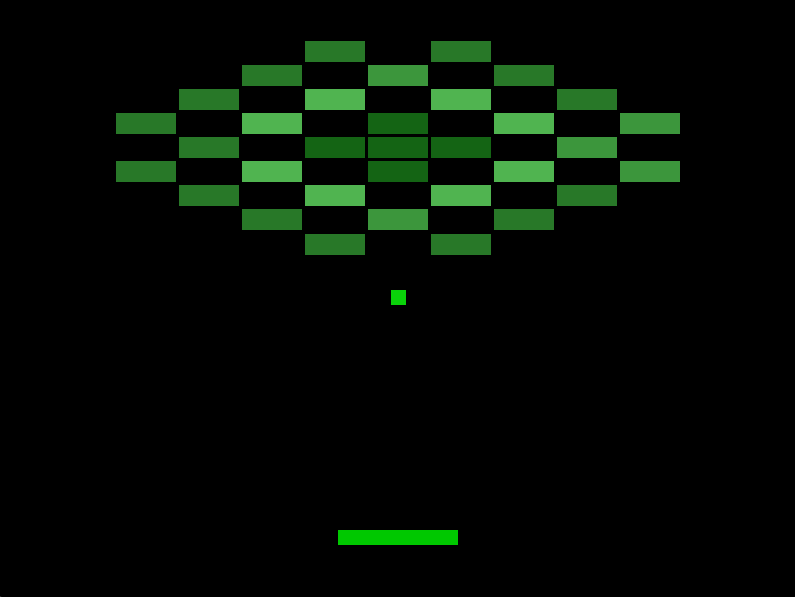

# PhezuEngine

**A lightweight 2D Game Engine built in C++ with C# scripting.**  
Created as a personal learning project to understand engine architecture. There is a strong focus to keep the codebase as simple and readable as possible so others can use this as a learning resource.

---

## Features
- **C# scripting** through Mono integration  
- **Prefab system** with nesting and overrides
- **Physics system** (axis-aligned boxes only)
- **Asset Management** of 7 types of assets
- **OpenGL Rendering** of sprites
- **Minimal dependencies** and simple

## Goals
- Make engine programming **easy and accessible** for learners  
- Enable creation of **simple classic games** like *Pac-Man, Breakout, Tetris, Snake,* or *Pocket Tanks*  
- Keep the **codebase simple and readable**  
- Maintain **as few dependencies as possible**

## Dependencies
- [Mono](https://www.mono-project.com/) Used for scripting

## Technical Overview
- Written in **C++17**.
- Uses **CMake** for cross-platform builds.
- Mono integration for **runtime C# scripting**.
- Custom **OpenGL** rendering backend.
- List of currently supported assets:
    - Scene
    - Prefab
    - Image
    - Texture
    - Shader
    - Material
    - Mesh
  
Project consists of 4 subprojects:
- Phezu - This is the static library containing the engine code.
- Runtime - This is the executable that links to Phezu and launches the engine.
- ScriptCore - This is the C# dll containing all of the engine classes.
- Editor
  - EditorShell - (This is an executable which will link to Phezu and run editor commands)
  - EditorGUI - (This will use imgui and EditorShell to run the editor app)
 
List of all third party code used (Mostly single headers):
  - glm
  - nlohmann
  - stb_image
  - glad
  - mono

## CI/CD Tested Configurations

- Windows x64 — Debug
- Windows x64 — Release
- Windows x64 — Visual Studio IDE (2017-2026)
- Windows x64 — Visual Studio Build Tools
  
---

## Windows Setup
**Requirements**
```bash
  None
```

**Instructions**
```bash
1. Clone or download the repository
2. Run Scripts/win32/Setup_Win.bat
```

## Linux and Mac not currently supported

## Current Roadmap 
- Add a documentation site.
- Add custom physics module.
- Remove Mono as a dependency (Much Later).
- Android support (Much Later).
- Editor application (Much Later).

---

## Demo

> *This is a preview of the sample breakout game. [Link](https://github.com/Faizu314/Phezu-Breakout)*

